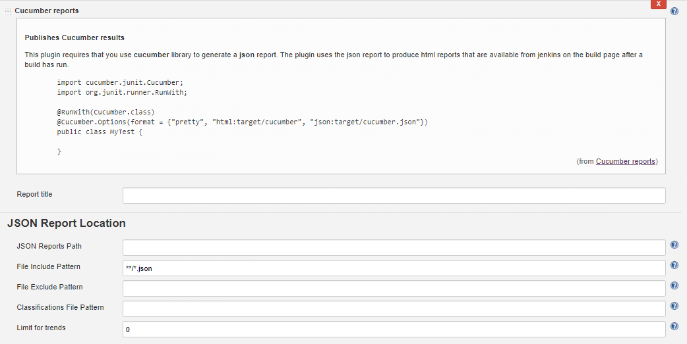
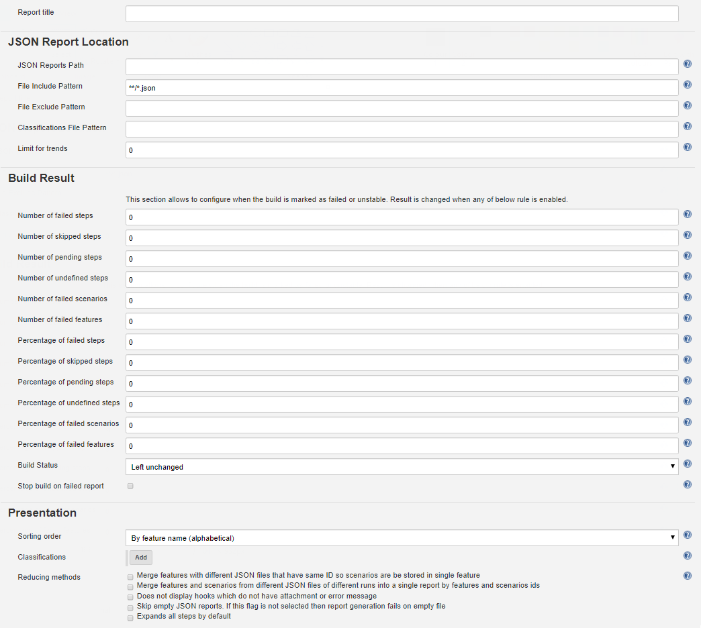

[](https://ci.jenkins.io/job/Plugins/job/cucumber-reports-plugin/job/master/)

[](https://plugins.jenkins.io/cucumber-reports)
[](https://damianszczepanik.github.io/cucumber-html-reports/overview-features.html)

# Publish pretty [cucumber](https://cucumber.io/) reports on [Jenkins](http://jenkins-ci.org/)

This is a Java Jenkins plugin which publishes [pretty html reports](https://github.com/damianszczepanik/cucumber-reporting) showing the results of cucumber runs. To use with regular cucumber just make sure to run cucumber like this: cucumber `--plugin json -o cucumber.json`

## Background

Cucumber is a test automation tool following the principles of [Behavioural Driven Design](https://en.wikipedia.org/wiki/Behavior-driven_development) and living documentation. Specifications are written in a concise [human readable form](https://cucumber.io/docs/reference) and executed in continuous integration. 

This plugin allows Jenkins to publish the results as pretty html reports hosted by the Jenkins build server. In order for this plugin to work you must be using the JUnit runner and generating a json report. The plugin converts the json report into an overview html linking to separate feature file htmls with stats and results. 

## Install

1.  [Get](https://jenkins-ci.org/) Jenkins.
2.  Install the [Cucumber Reports](https://wiki.jenkins-ci.org/display/JENKINS/Cucumber+Reports+Plugin) plugin.
3.  Restart Jenkins.

Read this if you need further  [detailed install and configuration](https://github.com/jenkinsci/cucumber-reports-plugin/wiki/Detailed-Configuration) instructions 

## Use
You must use a **Freestyle project type** in jenkins.

With the cucumber-reports plugin installed in Jenkins, you simply check the "Publish cucumber results as a report" box in the
publish section of the build config:


If you need more control over the plugin you can click the Advanced button for more options:



1.  Report title can be used to publish multiple reports from the same job - reports with different titles are stored separately; or leave blank for a single report with no title
2.  Leave empty for the plugin to automagically find your json files, or enter a base folder relative to the workspace if for some reason the automagic doesn't work for you
3.  Leave default, or specify an ant-style pattern for report json files in case you need to select only specific files
4.  Specify which json files should be excluded from prior selection
5.  If you would like to include .properties files containing metadata to be displayed in the report's top right corner, specify them via ant-style pattern here. Attention: Equal to File Include/Exclude Pattern, files are searched only below JSON Reports Path
6.  Configure how many historical reports to keep (0 = no limit)

## Advanced Configuration Options

There are 4 advanced configuration options that can affect the outcome of the build status. Click on the Advanced tab in the configuration screen:



The first setting is Skipped steps fail the build - so if you tick this any steps that are skipped during executions will be marked as failed and will cause the build to fail:

If you check both skipped and not implemented fails the build then your report will look something like this:

Make sure you have configured cucumber to run with the JUnit runner and to generate a json report: (note - you can add other formatters in if you like e.g. pretty - but only the json formatter is required for the reports to work)
```java
  import cucumber.junit.Cucumber;
  import org.junit.runner.RunWith;
  
  @RunWith(Cucumber.class)
  @Cucumber.Options(format = {"json:target/cucumber.json"})
  public class MyTest {
  
  }
```

## Automated configuration

### Pipeline usage

Typical step for report generation:
```groovy
node {
    stage('Generate HTML report') {
        cucumber buildStatus: 'UNSTABLE',
                reportTitle: 'My report',
                fileIncludePattern: '**/*.json',
                trendsLimit: 10,
                classifications: [
                    [
                        'key': 'Browser',
                        'value': 'Firefox'
                    ]
                ]
    }
}
```
or post action when the build completes with some fancy features for the Gerrit integraion:
```groovy
post {
    always {
        cucumber buildStatus: 'UNSTABLE',
                failedFeaturesNumber: 1,
                failedScenariosNumber: 1,
                skippedStepsNumber: 1,
                failedStepsNumber: 1,
                classifications: [
                        [key: 'Commit', value: '<a href="${GERRIT_CHANGE_URL}">${GERRIT_PATCHSET_REVISION}</a>'],
                        [key: 'Submitter', value: '${GERRIT_PATCHSET_UPLOADER_NAME}']
                ],
                reportTitle: 'My report',
                fileIncludePattern: '**/*cucumber-report.json',
                sortingMethod: 'ALPHABETICAL',
                trendsLimit: 100
    }
}
 ```

### Raw DSL - This should be utilized after build steps (note that the title is not specified in this example)

```groovy
configure { project ->
  project / 'publishers' << 'net.masterthought.jenkins.CucumberReportPublisher' {
    fileIncludePattern '**/*.json'
    fileExcludePattern ''
    jsonReportDirectory ''
    failedStepsNumber '0'
    skippedStepsNumber '0'
    pendingStepsNumber '0'
    undefinedStepsNumber '0'
    failedScenariosNumber '0'
    failedFeaturesNumber '0'
    buildStatus 'FAILURE'  //other option is 'UNSTABLE' - if you'd like it left unchanged, don't provide a value
    trendsLimit '0'
    sortingMethod 'ALPHABETICAL'
  }
}
```

When a build runs that publishes cucumber results it will put a link in the sidepanel to the [cucumber reports](https://github.com/damianszczepanik/cucumber-reporting). There is a feature overview page:


And there are also feature specific results pages:


And useful information for failures:


If you have tags in your cucumber features you can see a tag overview:


And you can drill down into tag specific reports:


## Develop

Interested in contributing to the Jenkins cucumber-reports plugin?  Great!  Start [here](https://github.com/jenkinsci/cucumber-reports-plugin).
